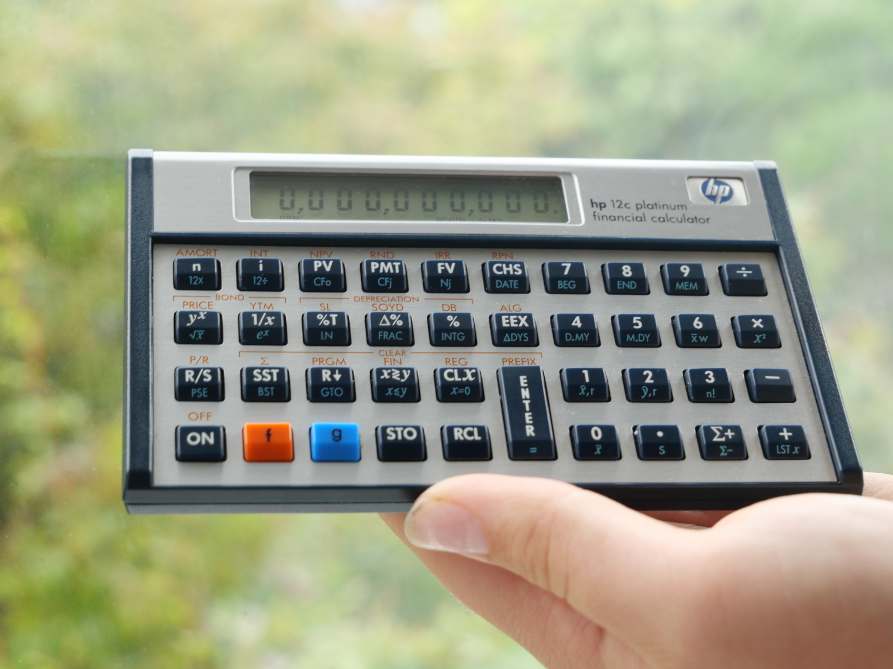
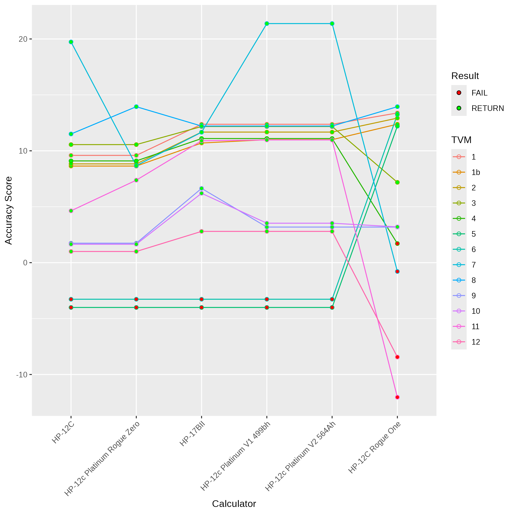
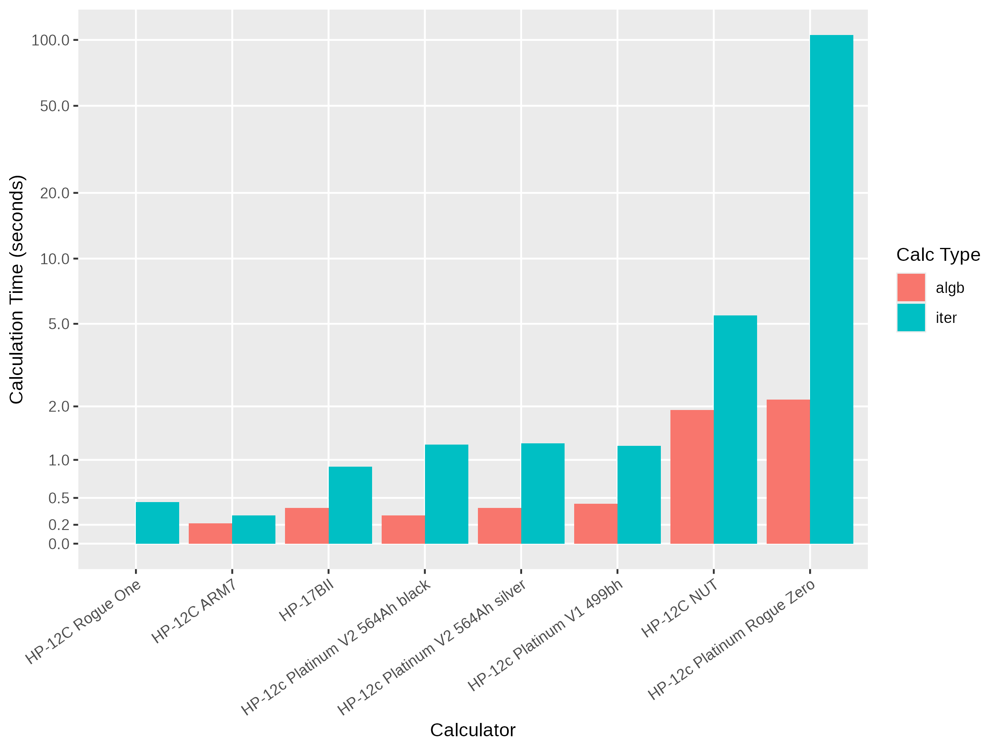
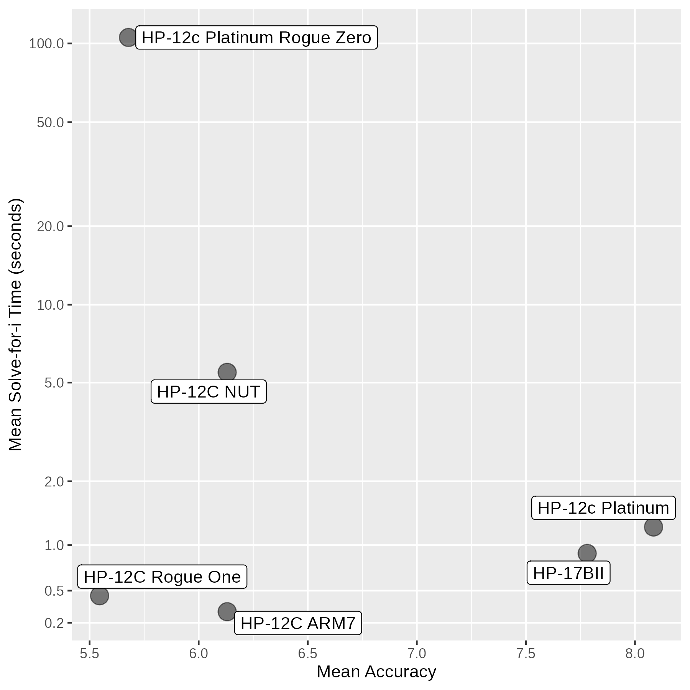
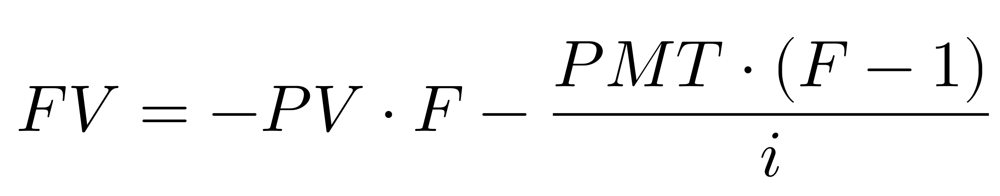
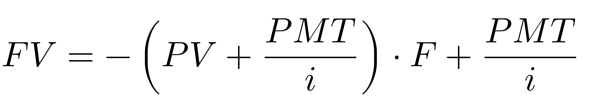

# Rogue Zero: An HP-12c Story

2026-03-11

## By dm319 and Tony Hutchins

### Introduction

A long time ago, in a galaxy far, far away, a calculator manufacturer, known as Kinpo, requested the user manual of the HP-12C from The Museum of HP Calculators[1].  They were making a new HP-12C!

But why?  By 2003, HP had already released a number of successors to the HP-12C: the HP-10B, HP-17B, HP-17BII and HP-19BII to name a few.  Yet none of these displaced the HP-12C, which had become an icon in the finance world as the de facto financial calculator.  When it was introduced as part of the Voyager series, it was never intended to have such a life span, and its scientific compatriots had been discontinued 14 years prior.

While HP were in the enviable position of having a calculator considered the gold standard[2], it may also have posed a predicament for them.  The calculator firmware ran on the NUT core processor, possibly made solely for this product.  HP spinoff Agilent were manufacturing and supplying this processor[3].  To have such an important product reliant on this fabrication process was likely expensive and a liability.  To compound matters, the HP-12C's source code had been lost, dashing hopes of a simple port to available off-the-shelf chipsets.

What was needed was a definitive replacement for the HP-12C, and that would be the HP-12c Platinum.  Platinum being more valuable than gold, and coloured likewise, it seemed positioned to succeed the HP-12C.  To entice buyers, the calculator would have algebraic as well as reverse polish notation functionality, more memory and a faster processor.  But how would they make this?

The apocryphal story is that Kinpo, an Original Equipment Manufacturer headquartered in Taiwan, completely re-implemented the HP-12C on newer 6502-based hardware, and did so purely on the basis of the user manual[1].

Early reports were not ideal however, and the HP-12c Platinum developed a reputation for _not_ being the HP-12C replacement, with professors advising their students against buying the new version, and financial users discerning the gold version as the original and best.[4]

As part of a wider programme of financial calculator testing[5], DM was surprised that the HP-12c Platinum, despite reports of subpar performance, had bettered the HP-12C on every Time Value of Money (TVM) problem, aligning itself very closely with the Saturn-era HP calculators.  Some of this clearly related to its 12-digits and excellent use of the extra precision.  But still, its accuracy was unexpected given the early reports and origin story.

In general, improvements in TVM ability are hard-earned and usually a closely-guarded company secret, with many other examples of higher-precision calculators failing to reach the achievements of the HP-12C.

The tested HP-12c Platinum felt like the product of historical HP TVM understanding, but this didn't marry with the story of it being built from scratch by Kinpo, nor with reports of wayward results.  We tested a range of HP-12c Platinums dating back to the earliest models to understand what had changed from early reports.

### Methods

| Model                      | Notes                       | Processor | Firmware                  | Year |
|----------------------------|-----------------------------|-----------|---------------------------|------|
| HP-12C                     | Original HP-12C             | NUT       |                           | 1981 |
| HP-12C                     | ARM HP-12C                  | ARM7      | ChE - - E1E1h  2012-04-03 | 2012 |
| HP-12C                     | HP 12c PC Emulator          | emulated  | NA                        | 2012 |
| HP-12c Platinum Rogue Zero | no parens silver faceplate  | 6502      | ChE - - 0EdFH  Ver 01     | 2003 |
| HP-12c Platinum            | prototype, gold trim parens | 6502      | ChE - - 499bh  Ver 01     | ?    |
| HP-12c Platinum            | parens, silver faceplate    | 6502      | ChE - - 564Ah  ver 02     | 2005 |
| HP-12c Platinum            | parens, black faceplate     | 6502      | ChE - - 564Ah  ver 02     | 2008 |
| HP-12C Rogue One           |                             | 6502      | ChE - - 3198h  2023-03-19 | 2024 |

A physical HP-12C (Original NUT processor and ARM7), an emulated HP-12C, a modern HP-12c Platinum, two early HP-12c Platinums, a prototype HP-12c Platinum, the HP-12C Rogue One, the HP-17BII and a Victor V12 were tested.  See table above for full details.  The TVM problems were described here[5].  Results were recorded in plain text and analysed using R with the multiple precision library set at an excessive 2000 bit precision.  The results were compared to a high-precision reference value, and the error was measured by taking the absolute difference between the reference value and calculator result.  For non-interest rate solves, this was divided by the reference value to provide a relative error.  These errors were converted to an accuracy measurement by taking the -log10 value.  Failure to return a result was awarded -3 below the worst performer of all calculators tested (including other models).

### Accuracy of the Rogue Zero

|calculator                  |1    |1b   |2    |3    |4    |5    |6    |7    |8    |9    |10   |11   |12   |
|:---------------------------|:----|:----|:----|:----|:----|:----|:----|:----|:----|:----|:----|:----|:----|
|HP-12c Platinum V1 499bh    |12.4 |11   |11.7 |12.2 |11.1 |ERR  |ERR  |21.4 |12.2 |3.2  |3.5  |11   |2.8  |
|HP-12c Platinum V2 564Ah    |12.4 |11   |11.7 |12.2 |11.1 |ERR  |ERR  |21.4 |12.2 |3.2  |3.5  |11   |2.8  |
|HP-17BII                    |12.4 |10.7 |11.7 |12.2 |11.1 |ERR  |ERR  |11.7 |12.2 |6.6  |6.2  |10.9 |2.8  |
|HP-12c                      |9.6  |8.6  |8.8  |10.6 |9.1  |ERR  |ERR  |19.7 |11.5 |1.7  |1.6  |4.6  |1    |
|HP-12c Platinum V1 0EdFH    |9.6  |8.6  |8.8  |10.6 |9.1  |ERR  |ERR  |8.7  |13.9 |1.7  |1.6  |7.4  |1    |
|Victor V12 V1 76F7H         |9.6  |8.6  |8.8  |10.6 |9.1  |ERR  |ERR  |8.7  |13.9 |1.7  |1.6  |ERR  |1    |
|HP-12c Rogue One            |13.4 |12.4 |12.9 |7.2  |ERR  |12.2 |13.2 |ERR  |13.9 |3.2  |3.2  |ERR  |ERR  |

It was immediately noticed that the HP-12c Platinum with firmware V1 and checksum 0EdFH was different.  Firstly, it returned only 10 digit precision, and secondly it was substantially slower than the original HP-12C NUT.  Some results did not match either the HP-12C or the later HP-12c Platinums.  We dubbed it the 'Rogue Zero', as it represents the first HP-12C to have a functionally different TVM solver.

Considering the Rogue Zero may have been engineered from scratch, it did remarkably well, providing digit-for-digit equivalent results for P1, P1b, P2, P3, P9, P10 and P12.  This suggests that its algebraic algorithms included an implementation of ln(x+1) and e^x-1, and were otherwise sound.  It also did well on the easier P1b solve-for-i.

Differences start to be seen where solve-for-i gets harder.  On P4 it delivers a different but similarly accurate result.  Similar to all other HPs — except the Rogue One — it does not return a result on solutions with multiple roots (P5, P6).  On P7, the very-small-solve-for-i problem, the Rogue Zero doesn't do so well against an outstanding result from the original HP-12C.  This is the only test where it falls short, returning the egregious error of a wrong sign.  Conversely, on P8, another very-small-solve-for-i problem (without a periodic payment) it gets the best result of any HP calculator, tied with the HP-12C Rogue One.  On P11, where there is a solve-for-i with a very high N value, it also does better than the HP-12C.

With these battery of tests, it is hard to judge overall whether it is more accurate than the HP-12C, or less.  Our overall assessment is that it performs less well.  Its mean accuracy rating is less (brought down by P7) despite it being superior to the HP-12C on 2 tests and inferior on one.  Median scores are the same, but overall the edge should go to the HP-12C, due to returning the correct sign on P7.

### Calculation Speed of the Rogue Zero

Accuracy aside, what was more noticeable to users was that the Rogue Zero could take a very long time when solving-for-i.  The original HP-12C underwent a processor upgrade in 2001 to the 3V NUT processor.  Consumer testing found there was distrust in the results returning too quickly, and so it appears that calculations were purposefully slowed down in order to meet consumer expectations of 'thinking time'[6,7].

It would have been reassuring if the Rogue Zero returned results in a similar time-frame.  For algebraic calculations, both the HP-12C NUT and Rogue Zero take around 2 seconds to calculate P1, P2, P3, P9, P10 and P12.  However, there was a surprise in store for solve-for-i!  P1b took over 31 seconds to complete, as opposed to 13.3s on the HP-12C NUT.  It took over 30 seconds again for P4, 30 seconds for P7 (vs 2.9s for the HP-12C NUT), oddly only 2.9s on the non-PMT P8 solve, and a monstrous 426 seconds for P11 (vs 1.3s)!

It might have been forgiven (or even praised!) for taking longer than the original HP-12C had the results been more accurate.  Unfortunately for the Rogue Zero, returning different results to the HP-12C was enough to seal its fate, and compounded by inconveniently increased calculation times, it was not looking good.

It seems like the Rogue Zero was pulled from the shelves[8] — much like the Rogue One two decades later in Brazil[9] — and this early model is relatively rare to find these days, suggesting it may not have been on sale for long.  When the HP-12c Platinum returned to shelves, its firmware had been updated.  Machine V1 499bh, which appears to be a development model, appeared to operate identically (from a TVM perspective) to the later V2 564Ah.  This later firmware was the definitive firmware in subsequent models, finding itself in the silver faceplate HP-12c Platinums, as well as black faceplate models.

Testing these three later HP-12c Platinums (referred to collectively as regular HP-12c Platinums), we found a world of difference, with all three returning identical results and timings.  They utilise a 12-digit calculation engine and make good use of those two extra digits.  For the algebraic results, the HP-12c Platinum returned an extra 1-2 digits of accurate results for P1, P2, P3, P9 and P10.

It was able to achieve this accuracy improvement in a far faster time than the Rogue Zero of around 0.3-0.4 seconds.  There are reports the Sunplus 6502 processor was upgraded from V1 to V2, which may have contributed to this speed improvement[10].  When it comes to solve-for-i, the HP-12c Platinum excels again, usually achieving another 2 extra digits of precision over the original HP-12C, in — on average — only 1.2 seconds.

Clearly the code had been reworked, apparently being rewritten with code from the HP-17BII+[10,11].  By this time, the Saturn code (presumably including its TVM solver) had been re-written in C[12], allowing the HP Saturn range to continue beyond the Saturn processor.

The HP-12c Platinum being rewritten using Saturn code fits with our testing, as it returns identical results to the HP-17Bii for the algebraic solves. (We are excepting P9 and P10 where the HP-12C style was to return an integer.)  Saturn calculators used 15 digit internal precision and 12 digit available precision, and I suspect the later HP-12c Platinum did so also.

A little strangely though, the HP-12c Platinum did not take the interest rate solver from the Saturn machines.  It does better as a result, getting a slightly more accurate result for P1b than the Saturns.  For P4 it gets identical results to the HP-17BII.  Similar to other HP calculators, there are no results returned for multiple root problems P5 and P6.  It delivers an outstanding result on P7 — which the Saturns had a slight regression on compared to the HP-12C — and pretty good results for P8 also.

The other Rogue landed almost exactly 20 years later.  Rogue One has some similarities with Rogue Zero; firstly, they both run on the 6502 chip.  Secondly, the Rogue One returned worse results than the regular HP-12C in certain situations.  Both caused some reputational damage for HP, and both seemingly spent a short time on the shelves.

However, there are some key differences.  While the Rogue Zero may have been born out of the necessity to switch to a new processor, the Rogue One was not, and the reasons for the existence of the Rogue One remain unknown outside of HP to this day.  What is interesting is that while Rogue Zero was most deficient in speed, Rogue One excelled here failing on accuracy.  It appeared to not implement a ln(1+x) method, it did not catch the i=0 case, and it did not draw on hard-earned TVM solving knowledge.  It's 16-digit calculation engine could not compensate for these failings.

### The Flat-Rate Problem Reveals Inner Workings

In i = 10%, PV = 100, PMT = -10, the loan is never paid off, with the balance owing at the end of time remaining -100.  This section refers to this specific TVM problem.

This problem can be solved forward for FV, incrementing N.  As you increment N, starting at lower values, transition points (TP) occur as the calculator fails to return -100, with this point likely dependent on both the available precision of the calculator, and the formula used to calculate FV.

An interesting quirk of the HP calculators is that there appears to be a sequence of returning -100, to -1000 (transition point TP1K), and then to 0 (TP0).

The HP-12C TP1K is at N = 315, then TP0 at N = 339.  The HP-17BII TP1K is later at N = 363, with TP0 at N = 387.  This likely reflects their corresponding internal precision, but it was hard to understand why the -1000 transition occurred.

If we define F = (1+i)^N, then at the HP-17BII TP1K (N = 363), F just crosses the threshold into 1e15.  Specifically (limited to 15 digits precision) we go from : 964,166,476,569,010 to 1,060,583,124,225,910.  With the above formula, 15-digit precision intermediate values should be sufficient to calculate F-1 at N = 363 in the above equation.

However, the HP-17BII continues to return the erroneous result of -1000 up until N = 386.  Unsurprisingly, N = 387 is the point at which F crosses the threshold into 1e16.  What isn't clear is how the HP-17BII can return any result while F is in the 1e15 range, this being a 16 digit number.  While the internal precision of intermediate values in the Saturn is documented as 15 digits[13], the calculator may be capable of aligning numbers for subtraction using all 16 digits of its 64-bit registers.

This would allow 1,060,583,124,225,910 to have 1 subtracted from it, resulting in 1,060,583,124,225,909 which would be truncated to 1,060,583,124,225,900.  This truncation results in F-1 becoming F-10, which propagates resulting in the erroneous result of -1000 rather than -100.

This is very much theoretical, but we were unable to come up with another explanation for the -1000 result within the TP1K range.  At the TP0 point, F breaches into 1e16, a 17 digit number.  At this point, even if the calculation engine can use 16 digits for alignment, a subtraction of 1 becomes subtraction of 0, which results in the erroneous FV result of 0.

The HP-12C reflects a very similar pattern at a different scale.  TP1K occurs at N = 315, where F breaches 1e13, and TP0 occurs at N = 339, where F breaches 1e14.  Correspondingly, NUT processor internal precision is cited as being 13 digits, and similar to the Saturn, the registers are 14 digits (56-bit)[14].  If the NUT processor followed a similar pattern of using 13 digit precision with 14 digits alignment, then it would explain the same transitions seen in the HP-12C, at 2 orders of magnitude less.

The regular HP-12c Platinum demonstrates the same behaviour here as the HP-17BII, which strongly suggests it uses not only the same internal precision, but likely the same calculating platform.

The Rogue Zero does not have a TP1K, instead returning correct results up until N = 387, where it returns 0.  This suggests that the Rogue Zero has a different calculation engine to the other HP calculators, using 16 digit internal precision and 16 digits to align on.

Interestingly, the Rogue One continues to return -100 all the way to N = 1e99.  It is likely the Rogue One is using a solve-for-FV formula which isolates (PMT/i), allowing it to continue returning results despite the other term becoming 0.

As the N value is pushed even further, we find the HP-12C continues to return 0.  The HP-12C internal precision likely has the same exponent maximum as external precision, of 99, and this would normally be breached when N = 2416.  However, an overflow doesn't occur at this point on the HP-12C.  The HP-12C continues to return 0 up to N = 1e99, which implies that overflow is ignored in this calculation, likely using the value of 9.999999999e99.  It is not clear what the Rogue Zero internal exponent range is, but given it also returns values up to N = 1e99, it suggests it similarly ignores overflows in this calculation.

This is not the case with the HP-12c Platinum, where at N=314762, the 0 transitions to 9.999999999e99, representing the overflow value of an HP-12C.  At this point, N x LN(1.1) is 30,000.02, suggesting N x LN(i+1) is limited to <30,000.  Interestingly, the HP-17BII overflows at a later value of 483178, throwing an "ERROR: OVERFLOW".  This coincidently is where F is 1.08e20000, and equates to where N x LN(i+1) is 46,051.7.  This value of F should not overflow the internal precision of the Saturn (which uses 20 bits in 10's complement format), and is likely a coded limit within the algorithm which triggers overflow when N x LN(i+1) > 46,051.7.  It would seem like this value was reduced to 30,000 in the port to the HP-12c Platinum.

These limits were verified using I%=100%, PV=100, PMT=-100, which similarly transitions to overflow at N = (30000/LN(2)) on the HP-12c Platinum and at N = 20000 x LN(10)/LN(2) on the HP-17BII.

It's also worth noting here another difference between the HP-12c Platinum and the HP-17BII - the display exponent.  Differences here may reflect the physical form of the HP-12c Platinum which uses the 10 digit display of the Voyager series.  Possibly because of this limitation, its maximum exponent is +99 rather than +499 on the Saturns.  Another quirk is that f-PREFIX can only show 10 digits of the available 12 digit result.  The HP-12c Platinum follows the HP-12C style of overflow, which is to not throw an error but simply return 9.99..e99, whereas the HP-17BII will throw an error without returning a result.

Another variation of the flat-rate problem can also be adapted as a solve-for-i.  If FV is set to 0, and N = 360, solve-for-i still returns 10% (the true answer being fractionally below this, but 10% being a reasonable answer here).  All calculators tested in this study will return 10%, except it uniquely fails for the Rogue Zero.

### Another One Enters the Fray

In testing more than 60 financial calculators[5], there was not a single example of two calculators from different manufacturers matching in their results.  That is until we tested the Rogue Zero, where its results matched almost exactly with the Victor V12.  The V12 was introduced in 2007 by the Victor Adding Company.  It is a landscape calculator, with the same button layout as the HP-12C.  In fact, it has the exact same layout as the HP-12c Platinum Rogue Zero: an algebraic option, no backspace or parentheses.  This strongly suggests that not only is the TVM solving algorithm and calculation engine shared, but also the user interface and features.  the Victor returned 10-digit results, with digit-for-digit identical results for all but P11.  We found the Victor V12 calculated roughly 3.5x faster than the Rogue Zero.

On the flat-rate problem above, the Victor had a TP0 of N = 387, transitioning straight from -100 to 0, in the same fashion as the Rogue Zero.  On the flat-rate interest rate find (N = 360, i = ?, PV = 100, PMT = -10, FV = 0), having uniquely failed on the HP-12c Rogue Zero, also failed on the Victor V12.

P11 marked a difference between the Victor V12 and the Rogue Zero, failing on the former.  The Victor V12 also returns a checksum in a similar manner to the HP-12C: "CHE-76F7H VEr 01", this being different to the Rogue Zero "CHE--0EdFH VEr 01", suggesting the Victor V12 used a related but different firmware.

### Conclusions

|                            | HP-12C          | HP-12cP Rogue Zero | HP-12c Platinum | HP-12C Rogue One |
|----------------------------|-----------------|--------------------|-----------------|------------------|
| processor class            | NUT/ARM         | 6502               | 6502            | 6502             |
| processor                  | various         | SPLB20D            | GPLB31A         | GPL833FXXA ?     |
| firmware date (latest)     | 2015-01-05      | NA                 | C 2004 hP       | 2023-03-19       |
| digit precision            | 10              | 10                 | 12              | 16               |
| mean TVM accuracy          | 6.13            | 5.68               | 8.09            | 5.55             |
| mean time iteration (s)    | 5.5/0.3         | 105                | 1.2             | 0.45             |
| mean time algebraic (s)    | 1.9/0.2         | 2.2                | 0.4             | 0                |
| calculation logic          | BCD             | BCD                | BCD             | BCD              |
| guess for i                | yes             | no                 | yes             | no               |
| stack lift after TVM input | disabled        | enabled            | enabled         | disabled         |
| solve i=0                  | yes             | yes                | yes             | no               |
| solve multiple roots       | no              | no                 | no              | yes              |
| country origin             | multiple        | CN                 | CN mostly       | CN               |
| power                      | LR44/1-2xCR2032 | 1 x CR2032         | 1/2 x CR2032    | 2 x CR2032       |

I suspect that HP needed to move off their legacy NUT chip, which was manufactured by Agilent and redesigned as a CMOSC chip in 2001.  The attraction of moving the HP-12C production to an off-the-shelf 6502 is clear, and it may have been necessary.  The HP-12c Platinum "Rogue Zero" matched the HP-12C for many results, reflecting excellent accuracy in its algebraic solves.  For interest rate solves, it did fractionally worse overall.  For any other calculator, this would have been considered excellent, but unfortunately for the Rogue Zero, it would fail to fill the HP-12C's boots.  This was compounded by the substantially longer solving time, and as a result the HP-12c Platinum launch was not optimal.

HP could not use the original HP-12C code, as this had gone missing.  This left it in a difficult situation, and so to salvage the HP-12c Platinum, they used the HP-17BII+ code.  The original Saturn TVM code (presumably originating on the HP-18C) had been ported to C[12], allowing the calculation engine and algorithms to be compiled for the 6502 chip.

The HP-12c Platinum was not just a Saturn-era financial calculator in a Voyager shape, as there were a number of changes in the port.  The solve-for-i algorithm was not copied across.  The Saturn TVM code, at times, did not quite match the HP-12C (P7), and the HP-12c Platinum's solve-for-i code behaves closer to the HP-12C.  Other changes include the 2 digit exponent, returning an integer for solve-for-N, and retaining the same calculation overflow behaviour as the Voyagers, but retaining an internal overflow check at a different value to the Saturn code.

Even though the revised HP-12c Platinum exceeded the HP-12C in all metrics measured in this study, at this point the damage was done.  The HP-12C was eventually ported to the ARM platform by running the original code on a NUT emulator, and rather than being replaced, was sold in parallel with the HP-12c Platinum.  This provided a welcome speed boost to the original HP-12C, while retaining the exact same digit-for-digit behaviour.  (In the same manner as its forebears, it is now the HP-12c Platinum which needs to be ported to a new hardware platform as 6502-based chip designs are pushed out of the market by the ARM juggernaut.)

The flat-rate problem gave us a small window into what is happening internally.  It would be interesting to confirm whether subtraction really does align using the full width of the registers, allowing 1 digit over the internal precision.  The TVM results and the flat-rate characteristics strongly suggest the regular HP-12c Platinum runs on the Saturn calculating engine, and likely uses their algebraic TVM algorithms too.

Strangely enough, if it wasn't for the Rogue Zero, we may not have the HP-12C today, as the longest produced calculator in history.  And while the switch from NUT to ARM allowed the HP-12C line to continue, it likely set up the circumstances for the Rogue One, turning again to the 6502 as a way to reduce manufacturing costs.

And so it is that HP-12C calculators have been found to have four different TVM solvers.  Only the very earliest HP-12c Platinum demonstrated (minor) TVM and (major) speed issues.  Yet discussions around the HP-12c Platinum often express concern that the solving is suboptimal - this can be put to bed, as HP-12c Platinums featuring parentheses (the vast majority) offer superior solving to even the HP-12C.  The Rogue Zero, while short-lived, appeared to live on as the Victor V12.  We weren't able to find any reference to Victor outsourcing their calculators to Kinpo, or even if the V12 ran a 6502 processor, however we suspect both of these to be the case.

It turns out then that both tales were in fact true of the HP-12c Platinum.  It was both a calculator completely re-implemented by Kinpo from a user manual supplied by The Museum of HP Calculators, with variation in solving and speed, as well as being a calculator which inherited HP's TVM-solving prowess to create the most accurate TVM solver in HP's history.  

### Appendix A - Results

| calculator               | 1                  | 1b               | 2                |
|--------------------------|--------------------|------------------|------------------|
| HP-12c                   | -1368.148355       | 4.37321837       | 6803.092172      |
| HP-17BII                 | -1368.14835535     | 4.37321837229    | 6803.092162      |
| HP-12c Platinum V1 0EdFH | -1368.148355       | 4.37321837       | 6803.092172      |
| Victor V12 V1 76F7H      | -1368.148355       | 4.37321837       | 6803.092172      |
| HP-12c Platinum V1 499bh | -1368.14835535     | 4.3732183723     | 6803.092162      |
| HP-12c Platinum V2 564Ah | -1368.14835535     | 4.3732183723     | 6803.092162      |
| HP-12c Rogue One         | -1368.148355350521 | 4.37321837230967 | 6803.09216198641 |

| calculator               | 3                | 4                  |
|--------------------------|------------------|--------------------|
| HP-12c                   | 331667.0067      | -7.983367984e-10   |
| HP-17BII                 | 331667.006691    | -7.98336798336e-12 |
| HP-12c Platinum V1 0EdFH | 331667.0067      | -7.992e-10         |
| Victor V12 V1 76F7H      | 331667.0067      | -7.992e-10         |
| HP-12c Platinum V1 499bh | 331667.006691    | -7.98336798336e-12 |
| HP-12c Platinum V2 564Ah | 331667.006691    | -7.98336798336e-12 |
| HP-12c Rogue One         | 331666.984886944 | ERR                |

| calculator               | 5                 | 5A                | 5B  |
|--------------------------|-------------------|-------------------|-----|
| HP-12c                   | ERR               | ERR               | ERR |
| HP-17BII                 | ERR               | ERR               | ERR |
| HP-12c Platinum V1 0EdFH | ERR               | ERR               | ERR |
| Victor V12 V1 76F7H      | ERR               | ERR               | ERR |
| HP-12c Platinum V1 499bh | ERR               | ERR               | ERR |
| HP-12c Platinum V2 564Ah | ERR               | ERR               | ERR |
| HP-12c Rogue One         | 14.43587132808058 | 14.43587132808058 | ERR |

| calculator               | 6                 | 6A                | 6B  |
|--------------------------|-------------------|-------------------|-----|
| HP-12c                   | ERR               | ERR               | ERR |
| HP-17BII                 | ERR               | ERR               | ERR |
| HP-12c Platinum V1 0EdFH | ERR               | ERR               | ERR |
| Victor V12 V1 76F7H      | ERR               | ERR               | ERR |
| HP-12c Platinum V1 499bh | ERR               | ERR               | ERR |
| HP-12c Platinum V2 564Ah | ERR               | ERR               | ERR |
| HP-12c Rogue One         | 58.46195526622093 | 58.46195526622093 | ERR |

| calculator               | 7                 | 8              |
|--------------------------|-------------------|----------------|
| HP-12c                   | 2.181818182e-10   | 3.125004736e-6 |
| HP-17BII                 | 2.16e-10          | 3.125001e-6    |
| HP-12c Platinum V1 0EdFH | -1.9068e-09       | 3.1250016e-6   |
| Victor V12 V1 76F7H      | -1.9068e-9        | 3.1250016e-6   |
| HP-12c Platinum V1 499bh | 2.18181818182e-10 | 3.125001e-6    |
| HP-12c Platinum V2 564Ah | 2.18181818182e-10 | 3.125001e-6    |
| HP-12c Rogue One         | ERR               | 3.1250016e-6   |

| calculator               | 9             | 10            |
|--------------------------|---------------|---------------|
| HP-12c                   | 1041          | 1052          |
| HP-17BII                 | 1060.30314751 | 1076.32021913 |
| HP-12c Platinum V1 0EdFH | 1041          | 1052          |
| Victor V12 V1 76F7H      | 1041          | 1052          |
| HP-12c Platinum V1 499bh | 1061          | 1076          |
| HP-12c Platinum V2 564Ah | 1061          | 1076          |
| HP-12c Rogue One         | 1061          | 1077          |

| calculator               | 11             | 12      |
|--------------------------|----------------|---------|
| HP-12c                   | 0.1666898147   | -900    |
| HP-17BII                 | 0.166666666654 | -1001.6 |
| HP-12c Platinum V1 0EdFH | 0.1666667088   | -900    |
| Victor V12 V1 76F7H      | ERR            | -900    |
| HP-12c Platinum V1 499bh | 0.166666666656 | -1001.6 |
| HP-12c Platinum V2 564Ah | 0.166666666656 | -1001.6 |
| HP-12c Rogue One         | ERR            | ERR     |

### Appendix B - Timings

| calculator                     | 1   | 1b   | 2   |
|--------------------------------|-----|------|-----|
| HP-17BII                       | 0.4 | 1.1  | 0.4 |
| HP-12c ARM7                    | 0.2 | 0.3  | 0.2 |
| HP-12c Rogue One               | 0.0 | 0.5  | 0.0 |
| HP-12c Platinum V1 0EdFH       | 1.8 | 31.7 | 2.4 |
| HP-12c Platinum V1 499bh       | 0.6 | 2.5  | 0.4 |
| HP-12c Platinum V2 564Ah silver| 0.4 | 2.9  | 0.4 |
| HP-12c Platinum V2 564Ah black | 0.3 | 2.7  | 0.3 |
| HP-12c NUT                     | 1.9 | 13.3 | 2.1 |

| calculator                     | 3   | 4    |
|--------------------------------|-----|------|
| HP-17BII                       | 0.3 | 0.6  |
| HP-12c ARM7                    | 0.2 | 0.3  |
| HP-12c Rogue One               | 0.0 | ERR  |
| HP-12c Platinum V1 0EdFH       | 3.1 | 36.1 |
| HP-12c Platinum V1 499bh       | 0.4 | 0.9  |
| HP-12c Platinum V2 564Ah silver| 0.4 | 0.6  |
| HP-12c Platinum V2 564Ah black | 0.3 | 1.2  |
| HP-12c NUT                     | 1.1 | 3.1  |

| calculator                     | 5   | 6   |
|--------------------------------|-----|-----|
| HP-17BII                       | ERR | ERR |
| HP-12c ARM7                    | ERR | ERR |
| HP-12c Rogue One               | 0.6 | 0.6 |
| HP-12c Platinum V1 0EdFH       | ERR | ERR |
| HP-12c Platinum V1 499bh       | ERR | ERR |
| HP-12c Platinum V2 564Ah silver| ERR | ERR |
| HP-12c Platinum V2 564Ah black | ERR | ERR |
| HP-12c NUT                     | ERR | ERR |

| calculator                     | 7    | 8   |
|--------------------------------|------|-----|
| HP-17BII                       | 1.5  | 0.5 |
| HP-12c ARM7                    | 0.3  | 0.3 |
| HP-12c Rogue One               | ERR  | 0.1 |
| HP-12c Platinum V1 0EdFH       | 30.1 | 2.9 |
| HP-12c Platinum V1 499bh       | 0.8  | 0.4 |
| HP-12c Platinum V2 564Ah silver| 1.1  | 0.3 |
| HP-12c Platinum V2 564Ah black | 0.7  | 0.3 |
| HP-12c NUT                     | 2.9  | 5.2 |

| calculator                     | 9   | 10  |
|--------------------------------|-----|-----|
| HP-17BII                       | 0.4 | 0.4 |
| HP-12c ARM7                    | 0.3 | 0.2 |
| HP-12c Rogue One               | 0.0 | 0.0 |
| HP-12c Platinum V1 0EdFH       | 2.1 | 2.3 |
| HP-12c Platinum V1 499bh       | 0.4 | 0.4 |
| HP-12c Platinum V2 564Ah silver| 0.3 | 0.4 |
| HP-12c Platinum V2 564Ah black | 0.3 | 0.3 |
| HP-12c NUT                     | 1.8 | 2.1 |

| calculator                     | 11  | 12  |
|--------------------------------|-----|-----|
| HP-17BII                       | 0.8 | 0.4 |
| HP-12c ARM7                    | 0.3 | 0.2 |
| HP-12c Rogue One               | ERR | ERR |
| HP-12c Platinum V1 0EdFH       | 426 | 1.3 |
| HP-12c Platinum V1 499bh       | 1.5 | 0.4 |
| HP-12c Platinum V2 564Ah silver| 1.4 | 0.4 |
| HP-12c Platinum V2 564Ah black | 1.3 | 0.3 |
| HP-12c NUT                     | 2.9 | 2.5 |

### Appendix C - Flat Rate

n = n, i = 10%, PV = 100, PMT = -10, solve-for-FV:

| n      | HP-12C | HP-12c Platinum Rogue Zero | HP-12c Platinum Regular | HP-12C Rogue One | HP-17BII        | Victor V12 |
|--------|--------|----------------------------|-------------------------|------------------|-----------------|------------|
| <117   | -100   | -100                       | -100                    | -100             | -100            | -100       |
| 314    | -100   | -100                       | -100                    | -100             | -100            | -100       |
| 315    | -1000  | -100                       | -100                    | -100             | -100            | -100       |
| 338    | -1000  | -100                       | -100                    | -100             | -100            | -100       |
| 339    | 0      | -100                       | -100                    | -100             | -100            | -100       |
| 362    | 0      | -100                       | -100                    | -100             | -100            | -100       |
| 363    | 0      | -100                       | -1000                   | -100             | -1000           | -100       |
| 386    | 0      | -100                       | -1000                   | -100             | -1000           | -100       |
| 387    | 0      | 0                          | 0                       | -100             | 0               | 0          |
| 314761 | 0      | 0                          | 0                       | -100             | 0               | 0          |
| 314762 | 0      | 0                          | 9.999999999e99          | -100             | 0               | 0          |
| 483177 | 0      | 0                          | 9.999999999e99          | -100             | 0               | 0          |
| 483178 | 0      | 0                          | 9.999999999e99          | -100             | ERROR: OVERFLOW | 0          |
| 1e99   | 0      | 0                          | 9.999999999e99          | -100             | ERROR: OVERFLOW | 0          |

### Acknowledgements

Thank you so much to Tangent and AnnoyedOne who provided many suggestions, edits and, constructive and amusing feedback.  Thank you to Brouhaha for his terrific resources on which much of this work is built upon, and thank you for everyone on the HP Museum forums, Swissmicros forums and r/calculators who contributed and helped with the TVM testing and my many queries!

### References

[1] https://www.hpmuseum.org/therest.htm

[2] https://www.alphr.com/technology/1001717/the-rebirth-of-the-hp-12c-how-one-man-reimagined-a-calculator-from-1981/

[3] https://old.reddit.com/r/calculators/comments/15tlfcs/wich_version_of_the_hp_12c_is_this/jwm9b2f/

[4] https://news.ycombinator.com/item?id=41530372

[5] https://www.hpcc.org/datafile/datafilev38.html#V38N2

[6] https://en.wikipedia.org/wiki/HP-12C "However, HP's market research found in the late 1980s that users did not trust results obtained too quickly and so the CPU speed was never improved from the original 884 kHz, but the speed could be increased by a user modification." (unable to find the primary source on this)

[7] https://tangentsoft.com/rpn/wiki?name=Recognizing%20HP-12C%20Variants

[8] https://www.hpmuseum.org/cgi-bin/archv013.cgi?read=38855

[9] https://dm319.github.io/pages/2024_09_09_hp12_comma.html

[10] http://www.brouhaha.com/~eric/hpcalc/voyager/variants.html

[11] https://persistent-tech.blogspot.com/2013/04/the-hewlett-packardhp-12c-financial.html

[12] https://www.hpmuseum.org/forum/thread-14061-post-124770.html#pid124770 

[13] https://www.hpmuseum.org/forum/thread-690-post-5574.html#pid5574

[14] https://www.hpmuseum.org/forum/thread-23804-post-206902.html#pid206902
